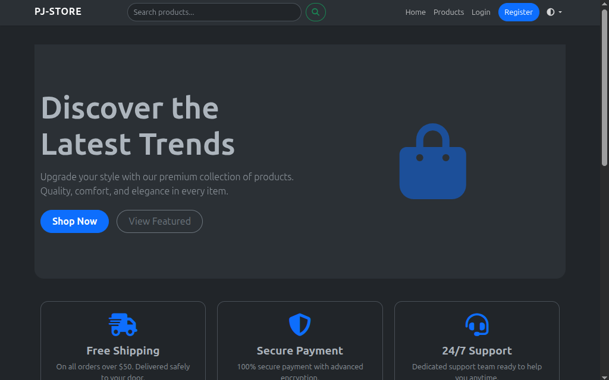

# PJ Store 🛒

[](https://www.python.org/downloads/)
[](https://flask.palletsprojects.com/)
[](https://opensource.org/licenses/MIT)

PJ Store is a comprehensive, full-stack e-commerce platform built with Python and Flask. It provides a robust, multi-role ecosystem for customers, sellers, and administrators, featuring product management, secure payments with Stripe, and an integrated support system.


## 🌟 Features

### 👥 User Roles & Management

- **Super Admin:** Full platform control, including managing admins and global settings.
- **Admin:** Manage users, approve sellers, and oversee product listings.
- **Seller:** Dedicated dashboard for managing products, variants, inventory, and orders.
- **Support:** Specialized interface for handling customer support tickets.
- **Customer:** Browsing products, managing a shopping cart, and tracking orders.

### 🛍️ E-commerce Core

- **Product Management:** Dynamic catalog with support for product variants (e.g., size, color, material) and price overrides.
- **Shopping Cart:** Real-time cart management for authenticated users.
- **Secure Checkout:** Full integration with **Stripe API** for processing payments safely.
- **Address Book:** Users can save and manage multiple shipping addresses with a default selection.

### 🛠️ Technical Highlights

- **Responsive Design:** Built with **Bootstrap 5** for a seamless experience across desktop and mobile.
- **Security:** Implements CSRF protection, secure password hashing, and role-based access control (RBAC).
- **Database:** Powered by **SQLAlchemy** with support for SQLite (development) and PostgreSQL (production).
- **Automation:** Includes a dedicated CLI script for initial Super Admin setup.

---

## 🚀 Tech Stack

- **Backend:** [Flask](https://flask.palletsprojects.com/)
- **Frontend:** HTML5, CSS3, [Bootstrap 5](https://getbootstrap.com/), JavaScript
- **Database:** [SQLAlchemy](https://www.sqlalchemy.org/) (ORM)
- **Forms:** [Flask-WTF](https://flask-wtf.readthedocs.io/) & [WTForms](https://wtforms.readthedocs.io/)
- **Authentication:** [Flask-Login](https://flask-login.readthedocs.io/)
- **Payments:** [Stripe](https://stripe.com/)
- **Environment:** [Python-Dotenv](https://github.com/theskumar/python-dotenv)

---

## ⚙️ Installation & Setup

### 1. Clone the Repository

```bash
git clone https://github.com/yourusername/PJ-Store-Flask.git
cd PJ-Store-Flask
```

### 2. Create a Virtual Environment

```bash
python3 -m venv venv
source venv/bin/bin/activate  # On Windows: venv\Scripts\activate
```

### 3. Install Dependencies

```bash
pip install -r requirements.txt
```

### 4. Environment Configuration

Create a `.env` file in the root directory and add the following:

```env
APP_SECRET_KEY=your_secret_key_here
STRIPE_PUBLIC_KEY=your_stripe_public_key
STRIPE_SECRET_KEY=your_stripe_secret_key
DATABASE_URL=sqlite:///site.db  # Or your PostgreSQL URL
```

### 5. Initialize the Database & Super Admin

Run the following command to create your first administrative account:

```bash
python create_super_admin.py
```

### 6. Run the Application

```bash
python run.py
```

The application will be available at `http://127.0.0.1:5000`.

---

## 📂 Project Structure

```text
PJ-Store-Flask/
├── app/
│   ├── auth/           # Authentication, User Models, & Dashboards
│   ├── main/           # Core landing pages and routes
│   ├── products/       # Product catalog, variants, and seller management
│   ├── orders/         # Shopping cart and order processing
│   ├── payments/       # Stripe integration and payment logic
│   ├── support/        # Ticket-based support system
│   ├── static/         # CSS, JS, and product images
│   └── templates/      # Jinja2 HTML templates
├── instance/           # Local database (SQLite)
├── create_super_admin.py # CLI for admin setup
├── run.py              # Application entry point
└── requirements.txt    # Project dependencies
```

---

## 🤝 Contributing

Contributions are welcome! Please feel free to submit a Pull Request.

1. Fork the Project
2. Create your Feature Branch (`git checkout -b feature/AmazingFeature`)
3. Commit your Changes (`git commit -m 'Add some AmazingFeature'`)
4. Push to the Branch (`git push origin feature/AmazingFeature`)
5. Open a Pull Request

---

## 📄 License

This project is licensed under the MIT License - see the [LICENSE](LICENSE) file for details.
